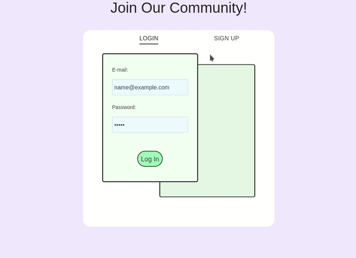

# Login Template
Log in system using Flask and Mongodb

## Examples

> Example of the login prompt

  

## Setup
This project was created with:

    python 3.9.1

Install the requirements with:

    pip install -r requirements.txt

You will need to link a **MongoDb** database with the project for storing and accessing data. Create a free account [here](https://www.mongodb.com/) and make note of the username and password.
You will have to create a "cluster" and connect with your current IP address by pressing the "connect" button on MongoDb.
When you have allowed a user from your IP address to serve as an admin, you can get your URI code.

The URI code is found by *Clusters > Connect > Connect an Application* This code will be used to connect Flask to MongoDb. Because I have abstracted this process you don't need to worry about that code so all that is necessary are the admin credentials below.

> If you are interested where the URI code goes in Flask it is in `pymongo.MongoClient(<URI_CODE>)` in `/app.py`.

Create a file named *config.py* to add your MongoDb credentials. From the `./login-template/` directory:

    touch config.py

Now populate the *config.py* file as outlined below:

    db_username = '<your_username>'
    db_password = '<your_password>'

    secret_key = '<your_secret_key'

Note your secret key can be any random sequence of characters. You need a secret key for flask sessions and I just used a hashing website and hashed random characters.

I made an executable named *run* which is a nice alias for starting the website locally.

If you're on Linux or WSL I recommend doing the same with

    chmod +x run

Now everything should be ready to go, just execute:

    ./run

And navigate to the locally hosted URL!
